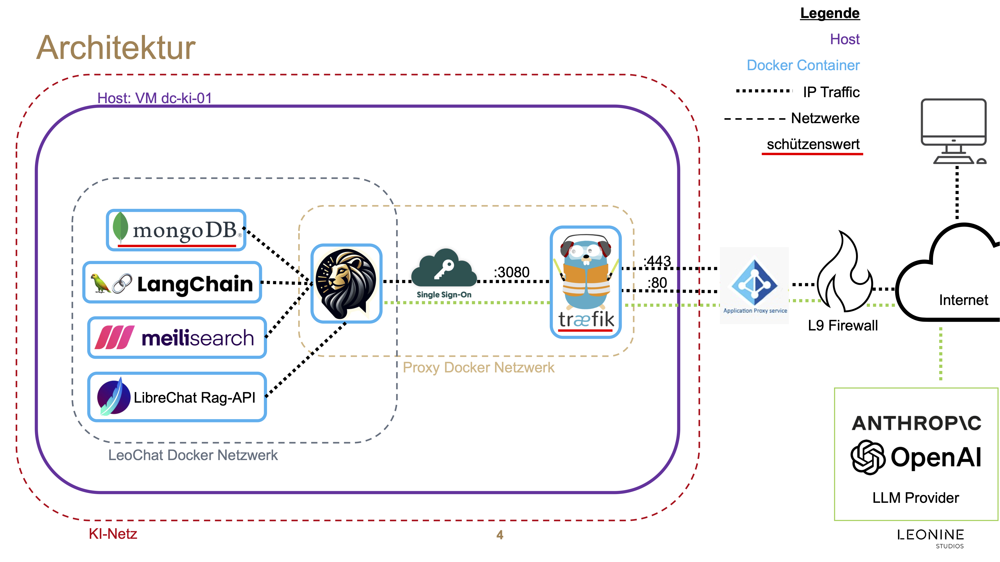

# LeoChat

## OpenSource Codebase

This project is based on the fantastic project [LibreChat - Home](https://www.librechat.ai/), [Librechat - Github](https://github.com/danny-avila/LibreChat).

## Development

1. To facilitate easy local development we have included Docker Containers for the backends:

```sh
cd .dev-backend
docker compose up -d
```

2. Install Dependencies

`npm ci`

3. Build frontend (each time you change something there)

`npm run backend`

4. Start Backend

`npm run backend`

5. Run tests according to [Librechat docu](https://www.librechat.ai/docs/development/testing#local-unit-tests)

```sh 
cp .env.example ./api/.env # needed for api tests to work
npm run test:api
npm run test:client 
```

test:api will always have one failed test!

6. Run linter

`npm run lint:fix`

Note: There is a pre-commit hook that will always run the linter before committing. If this fails for whatever reasons you cannot commit anything. 

## Developed Additional Features in LeoChat

### Advanced Balance Handling

tbd

### Advanced Tools/Plugins

tbd

## Container Architecture


